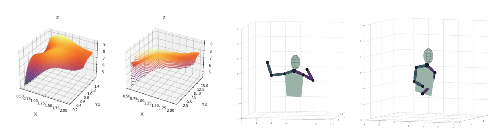

# OpenGL 3D Simulator for Python Data

20161105 Soogeun Park
20161190 Minjae Lee

## Abstract

#### Background

Python data를 visualize하기 위해 가장 많이 사용되는 방법은 `Matpoltlib` library를 사용하는 것입니다. 2차원 상의 데이터를 시각화 하는데에는 matplotlib으로 충분하지만, 3차원 데이터를 시각화 할 때에는 2D screen에 나타내는 것이기 때문에 여러 제약 사항이 있습니다.

- Image로 나타낼 경우, Fixed된 angle에서의 결과 모습만을 확인할 수 있습니다.
- 이를 극복하기 위해 figure를 조금씩 회전하면서 frame으로 만들고 이를 하나의 video로 만드는 방법이 있습니다. 하지만 이 역시 시야 (카메라)는 고정되어 있어서 원하는 부분을 확대하거나 시점(카메라)을 움직이는 등 자유로운 UI를 제공하지는 않습니다.

#### Goals

이 프로젝트의 목표는 Python 3D data를 사용자가 자유롭게 볼 수 있는 OpenGL 3D Simulator를 만드는 것입니다. 이 시뮬레이터는 Python을 이용하는 연구에서 Paper에 넣을 figure와 데모를 만들 때 유용하게 사용될 것이라 기대합니다.

#### Approach & Expected Outcomes

시뮬레이터의 구현은 크게 2가지 파트로 구분해서 진행될 것입니다. 

1. Render data in 3D space: Python data를 3D 공간 상에 좌표로 나타내기 위해서는 데이터의 domain과 range를 파악해서 3D 공간에 적절히 mapping하는 작업이 필요할 것입니다. 또한 공간의 Background 영역을 Cartesian coordinate system으로 표현하는 것과 시간이 지남에 따라 값이 변하는 데이터(예시: https://www.youtube.com/watch?v=LSN63LI0Qa8&t=144s)를 표현하는 것이 주된 task가 될 것입니다.
2. Simulater UI: 시점을 자유롭게 rotate, zoom, translate 할 수 있는 camera 인터페이스와 좌표계 (눈금) display를 on/off 할 수 있는 toggle 기능, Object에 mouse를 올리면 (hover) 해당 위치의 좌표를 나타내는 기능, 데이터의 3D representation (point cloud / mesh) 선택 등을 구현할 계획입니다. 

### Environment

- Python
- OpenGL